# wanderlust-travel Design System

You are building UI for **wanderlust-travel**. Dark-themed, neutral palette, sans-serif typography (Mona Sans), compact density on a 4px grid.

## Visual Reference

**IMPORTANT**: Study ALL screenshots below before writing any UI. Match colors, typography, spacing, layout, and motion exactly as shown.

### Homepage


### Scroll Journey (Cinematic Visual States)

> These screenshots capture the website at different scroll depths. The design changes dramatically as you scroll — each frame shows a different cinematic state. Replicate these exact visual transitions.

#### 0% — Hero / Above the fold


#### 17% — Mid-page at 17% scroll


#### 33% — Mid-page at 33% scroll


#### 50% — Mid-page at 50% scroll


#### 67% — Mid-page at 67% scroll


#### 83% — Mid-page at 83% scroll


#### 100% — Footer / End of page


> Read `references/DESIGN.md` for full token details. Read `references/ANIMATIONS.md` for motion specs. Read `references/LAYOUT.md` for layout structure. Read `references/COMPONENTS.md` for component patterns.

## Ultra Reference Files

This package includes extended documentation. **Read these files before implementing:**

| File | Contents |
|------|----------|
| `references/DESIGN.md` | Full design system tokens, colors, typography, spacing |
| `references/VISUAL_GUIDE.md` | **START HERE** — Master visual guide with all screenshots embedded |
| `references/ANIMATIONS.md` | CSS keyframes, scroll triggers, motion library stack, video specs |
| `references/LAYOUT.md` | Flex/grid containers, page structure, spacing relationships |
| `references/COMPONENTS.md` | DOM component patterns, HTML structure, class fingerprints |
| `references/INTERACTIONS.md` | Hover/focus states with before/after style diffs |
| `screens/scroll/` | 7 scroll journey screenshots showing cinematic states |

### Animation Stack Detected

- **Web Animations API (1 active)** — animation

## Design Philosophy

- **Layered depth** — use shadow tokens to create a sense of physical layering. Each elevation level has a specific shadow.
- **Solid colors only** — no gradients anywhere. Every surface is a single flat color.
- **Type pairing** — Mona Sans for body/UI text, Arial for headings/display. Never introduce a third typeface.
- **compact density** — 4px base grid. Every dimension is a multiple of 4.
- **neutral palette** — the color temperature runs neutral, matching the sans-serif typography.
- **Minimal motion** — prefer instant state changes. Only use transitions for loading and page transitions.

## Color System

### Core Palette

| Role | Token | Hex | Use |
|------|-------|-----|-----|
| Background | `--background` | `#0d0c22` | Page/app background |
| Surface | `--surface` | `#060318` | Cards, panels, modals |
| Text Primary | `--text-primary` | `#ffffff` | Headings, body text |
| Text Muted | `--text-muted` | `#6e6d7a` | Captions, placeholders |
| Border | `--border` | `#524b63` | Dividers, card borders |

### Status Colors

| Status | Hex | Use |
|--------|-----|-----|
| Danger | `#ea4c89` | Errors, destructive actions |

### Extended Palette

- `#b8509a`
- `#655c7a`
- `#000000` — Deep background layer or shadow color
- `#dbdbde`
- `#9e9ea7`
- `#3a3546`
- `#7b7194`
- `#e7e7e9` — Light surface or highlight color

## Typography

### Font Stack

- **Mona Sans** — Heading 1, Heading 2, Heading 3
- **Arial** — Body, Caption
- **IBM Plex Mono** — Code

### Font Sources

```css
@font-face {
  font-family: "Mona Sans";
  src: url("fonts/MonaSans-SemiBold.ttf") format("truetype");
  font-weight: 600;
}
@font-face {
  font-family: "Mona Sans";
  src: url("fonts/MonaSans-Bold.ttf") format("truetype");
  font-weight: 700;
}
@font-face {
  font-family: "Mona Sans";
  src: url("fonts/MonaSans-Regular.ttf") format("truetype");
  font-weight: 400;
}
@font-face {
  font-family: "IBM Plex Mono";
  src: url("fonts/IBMPlexMono-SemiBold.ttf") format("truetype");
  font-weight: 600;
}
@font-face {
  font-family: "IBM Plex Mono";
  src: url("fonts/IBMPlexMono-Bold.ttf") format("truetype");
  font-weight: 700;
}
@font-face {
  font-family: "IBM Plex Mono";
  src: url("fonts/IBMPlexMono-Regular.ttf") format("truetype");
  font-weight: 400;
}
```

### Type Scale

| Role | Family | Size | Weight |
|------|--------|------|--------|
| Heading 1 | Mona Sans | 48px / 3rem | 700 |
| Heading 2 | Mona Sans | 32px / 2rem | 600 |
| Heading 3 | Mona Sans | 24px / 1.5rem | 600 |
| Body | Arial | 16px / 1rem | 400 |
| Caption | Arial | 12px / 0.75rem | 400 |
| Code | IBM Plex Mono | 14px | 400 |

### Typography Rules

- Body/UI: **Mona Sans**, Headings: **Arial** — these are the only display fonts
- Max 3-4 font sizes per screen
- Headings: weight 600-700, body: weight 400
- Use color and opacity for text hierarchy, not additional font sizes
- Line height: 1.5 for body, 1.2 for headings

## Spacing & Layout

### Base Grid: 4px

Every dimension (margin, padding, gap, width, height) must be a multiple of **4px**.

### Spacing Scale

`4, 6, 8, 10, 12, 14, 16, 18, 20, 24, 28, 30` px

### Spacing as Meaning

| Spacing | Use |
|---------|-----|
| 4-8px | Tight: related items (icon + label, avatar + name) |
| 12-16px | Medium: between groups within a section |
| 24-32px | Wide: between distinct sections |
| 48px+ | Vast: major page section breaks |

### Border Radius

Scale: `6px, 8px, 10px, 12px, 12px 12px 0px 0px, 16px, 20px, 24px, 32px, 70px, 70px 0px 0px 70px`
Default: `16px`

## Component Patterns

### Card

```css
.card {
  background: #060318;
  border: 1px solid #524b63;
  border-radius: 16px;
  padding: 16px;
  box-shadow: rgba(0, 0, 0, 0.03) 0px 2px 6px 0px;
}
```

```html
<div class="card">
  <h3>Card Title</h3>
  <p>Card content goes here.</p>
</div>
```

### Button

```css
/* Primary */
.btn-primary {
  background: #444444;
  color: #ffffff;
  border-radius: 16px;
  padding: 8px 16px;
  font-weight: 500;
  transition: opacity 150ms ease;
}
.btn-primary:hover { opacity: 0.9; }

/* Ghost */
.btn-ghost {
  background: transparent;
  border: 1px solid #524b63;
  color: #ffffff;
  border-radius: 16px;
  padding: 8px 16px;
}
```

```html
<button class="btn-primary">Get Started</button>
<button class="btn-ghost">Learn More</button>
```

### Input

```css
.input {
  background: #0d0c22;
  border: 1px solid #524b63;
  border-radius: 16px;
  padding: 8px 12px;
  color: #ffffff;
  font-size: 14px;
}
.input:focus { border-color: var(--accent); outline: none; }
```

```html
<input class="input" type="text" placeholder="Search..." />
```

### Badge / Chip

```css
.badge {
  display: inline-flex;
  align-items: center;
  padding: 4px 8px;
  border-radius: 9999px;
  font-size: 12px;
  font-weight: 500;
  background: #060318;
  color: #6e6d7a;
}
```

```html
<span class="badge">New</span>
<span class="badge">Beta</span>
```

### Modal / Dialog

```css
.modal-backdrop { background: rgba(0, 0, 0, 0.6); }
.modal {
  background: #060318;
  border: 1px solid #524b63;
  border-radius: 70px 0px 0px 70px;
  padding: 24px;
  max-width: 480px;
  width: 90vw;
  box-shadow: rgba(0, 0, 0, 0.1) 0px 0px 10px 0px;
}
```

```html
<div class="modal-backdrop">
  <div class="modal">
    <h2>Dialog Title</h2>
    <p>Dialog content.</p>
    <button class="btn-primary">Confirm</button>
    <button class="btn-ghost">Cancel</button>
  </div>
</div>
```

### Table

```css
.table { width: 100%; border-collapse: collapse; }
.table th {
  text-align: left;
  padding: 8px 12px;
  font-weight: 500;
  font-size: 12px;
  color: #6e6d7a;
  text-transform: uppercase;
  letter-spacing: 0.05em;
  border-bottom: 1px solid #524b63;
}
.table td {
  padding: 12px;
  border-bottom: 1px solid #524b63;
}
```

```html
<table class="table">
  <thead><tr><th>Name</th><th>Status</th><th>Date</th></tr></thead>
  <tbody>
    <tr><td>Item One</td><td>Active</td><td>Jan 1</td></tr>
    <tr><td>Item Two</td><td>Pending</td><td>Jan 2</td></tr>
  </tbody>
</table>
```

### Navigation

```css
.nav {
  display: flex;
  align-items: center;
  gap: 8px;
  padding: 12px 16px;
  border-bottom: 1px solid #524b63;
}
.nav-link {
  color: #6e6d7a;
  padding: 8px 12px;
  border-radius: 16px;
  transition: color 150ms;
}
.nav-link:hover { color: #ffffff; }
```

```html
<nav class="nav">
  <a href="/" class="nav-link active">Home</a>
  <a href="/about" class="nav-link">About</a>
  <a href="/pricing" class="nav-link">Pricing</a>
  <button class="btn-primary" style="margin-left: auto">Get Started</button>
</nav>
```

## Page Structure

The following page sections were detected:

- **Hero** — Hero section (detected from heading structure)
- **Faq** — FAQ/accordion section

When building pages, follow this section order and structure.

## Animation & Motion

This project uses **subtle motion**. Transitions smooth state changes without calling attention.

### Motion Guidelines

- **Duration:** 150-300ms for micro-interactions, 300-500ms for page transitions
- **Easing:** `ease-out` for enters, `ease-in` for exits
- **Direction:** Elements enter from bottom/right, exit to top/left
- **Reduced motion:** Always respect `prefers-reduced-motion` — disable animations when set

## Depth & Elevation

### Shadow Tokens

- Raised (cards, buttons): `rgba(0, 0, 0, 0.03) 0px 2px 6px 0px`
- Floating (dropdowns, popovers): `rgba(0, 0, 0, 0.1) 0px 0px 10px 0px`
- Floating (dropdowns, popovers): `rgba(0, 0, 0, 0.5) 0px 0px 10px 0px`
- Overlay (modals, dialogs): `rgba(27, 32, 50, 0.1) 0px 15px 50px 0px`
- Overlay (modals, dialogs): `rgba(0, 0, 0, 0.06) 0px -6px 40px 0px`
- Overlay (modals, dialogs): `rgba(0, 0, 0, 0.06) 0px 1px 6px 0px, rgba(0, 0, 0, 0.16) 0px 2px 32px 0px`

## Anti-Patterns (Never Do)

- **No gradients** — solid colors only, everywhere
- **No blur effects** — no backdrop-blur, no filter: blur()
- **No zebra striping** — tables and lists use borders for separation
- **No invented colors** — every hex value must come from the palette above
- **No arbitrary spacing** — every dimension is a multiple of 4px
- **No extra fonts** — only Mona Sans and Arial and IBM Plex Mono are allowed
- **No arbitrary border-radius** — use the scale: 6px, 8px, 10px, 12px, 16px, 20px, 24px, 32px, 70px
- **No opacity for disabled states** — use muted colors instead

## Workflow

1. **Read** `references/DESIGN.md` before writing any UI code
2. **Pick colors** from the Color System section — never invent new ones
3. **Set typography** — Mona Sans, Arial, IBM Plex Mono only, using the type scale
4. **Build layout** on the 4px grid — check every margin, padding, gap
5. **Match components** to patterns above before creating new ones
6. **Apply elevation** — use shadow tokens
7. **Validate** — every value traces back to a design token. No magic numbers.

## Brand Spec

- **Favicon:** `/favicon.ico`
- **Site URL:** `https://dribbble.com/shots/21290124-Travel-Agency-Website-Design-To-Ignite-The-Wanderlust`
- **Brand typeface:** Mona Sans

## Quick Reference

```
Background:     #0d0c22
Surface:        #060318
Text:           #ffffff / #6e6d7a
Accent:         (not extracted)
Border:         #524b63
Font:           Mona Sans
Spacing:        4px grid
Radius:         16px
Components:     0 detected
```

## When to Trigger

Activate this skill when:
- Creating new components, pages, or visual elements for wanderlust-travel
- Writing CSS, Tailwind classes, styled-components, or inline styles
- Building page layouts, templates, or responsive designs
- Reviewing UI code for design consistency
- The user mentions "wanderlust-travel" design, style, UI, or theme
- Generating mockups, wireframes, or visual prototypes

---

# Full Reference Files

> Every output file is embedded below. Claude has full design system context from /skills alone.

## Design System Tokens (DESIGN.md)

# wanderlust-travel DESIGN.md

> Auto-generated design system — reverse-engineered via static analysis by skillui.
> Frameworks: None detected
> Colors: 20 · Fonts: 3 · Components: 0
> Icon library: not detected · State: not detected
> Primary theme: dark · Dark mode toggle: no · Motion: none

## Visual Reference

**Match this design exactly** — study colors, fonts, spacing, and component shapes before writing any UI code.


---

## 1. Visual Theme & Atmosphere

This is a **dark-themed** interface with a neutral tone. Depth is expressed through layered shadows and subtle surface color variation. Typography pairs **Arial** for display/headings with **Mona Sans** for body text, creating clear visual hierarchy through type contrast. Spacing follows a **4px base grid** (compact density), with scale: 4, 6, 8, 10, 12, 14, 16, 18px.

---

## 2. Color Palette & Roles

| Token | Hex | Role | Use |
|---|---|---|---|
| background | `#0d0c22` | background | Page background, darkest surface |
| surface | `#060318` | surface | Card and panel backgrounds |
| text-primary | `#ffffff` | text-primary | Headings and body text |
| text-muted | `#6e6d7a` | text-muted | Captions, placeholders, secondary info |
| border | `#524b63` | border | Dividers, card borders, outlines |
| danger | `#ea4c89` | danger | Error states, destructive actions |
| info | `#3e34d3` | info | Informational highlights |
| unknown | `#b8509a` | unknown | Palette color |
| unknown | `#655c7a` | unknown | Palette color |
| unknown | `#000000` | unknown | Palette color |
| unknown | `#dbdbde` | unknown | Palette color |
| unknown | `#9e9ea7` | unknown | Palette color |
| unknown | `#3a3546` | unknown | Palette color |
| unknown | `#7b7194` | unknown | Palette color |
| unknown | `#e7e7e9` | unknown | Palette color |
| unknown | `#262627` | unknown | Palette color |
| unknown | `#9890ac` | unknown | Palette color |
| unknown | `#807ea3` | unknown | Palette color |
| unknown | `#d86ad4` | unknown | Palette color |
| unknown | `#f3f3f4` | unknown | Palette color |


---

## 3. Typography Rules

**Font Stack:**
- **Mona Sans** — Heading 1, Heading 2, Heading 3
- **Arial** — Body, Caption
- **IBM Plex Mono** — Code

**Font Sources:**

```css
@font-face {
  font-family: "Mona Sans";
  src: url("fonts/MonaSans-SemiBold.ttf") format("truetype");
  font-weight: 600;
}
@font-face {
  font-family: "Mona Sans";
  src: url("fonts/MonaSans-Bold.ttf") format("truetype");
  font-weight: 700;
}
@font-face {
  font-family: "Mona Sans";
  src: url("fonts/MonaSans-Regular.ttf") format("truetype");
  font-weight: 400;
}
@font-face {
  font-family: "IBM Plex Mono";
  src: url("fonts/IBMPlexMono-SemiBold.ttf") format("truetype");
  font-weight: 600;
}
@font-face {
  font-family: "IBM Plex Mono";
  src: url("fonts/IBMPlexMono-Bold.ttf") format("truetype");
  font-weight: 700;
}
@font-face {
  font-family: "IBM Plex Mono";
  src: url("fonts/IBMPlexMono-Regular.ttf") format("truetype");
  font-weight: 400;
}
```

| Role | Font | Size | Weight |
|---|---|---|---|
| Heading 1 | Mona Sans | 48px / 3rem | 700 |
| Heading 2 | Mona Sans | 32px / 2rem | 600 |
| Heading 3 | Mona Sans | 24px / 1.5rem | 600 |
| Body | Arial | 16px / 1rem | 400 |
| Caption | Arial | 12px / 0.75rem | 400 |
| Code | IBM Plex Mono | 14px | 400 |

**Typographic Rules:**
- Limit to 3 font families max per screen
- Use **Mona Sans** for body/UI text, **Arial** for display/headings
- Maintain consistent hierarchy: no more than 3-4 font sizes per screen
- Headings use bold (600-700), body uses regular (400)
- Line height: 1.5 for body text, 1.2 for headings
- Use color and opacity for secondary hierarchy, not additional font sizes


---

## 4. Component Stylings

No components detected. Scan `src/components/` or `components/` to populate this section.

---

## 5. Layout Principles

- **Base spacing unit:** 4px
- **Spacing scale:** 4, 6, 8, 10, 12, 14, 16, 18, 20, 24, 28, 30
- **Border radius:** 6px, 8px, 10px, 12px, 12px 12px 0px 0px, 16px, 20px, 24px, 32px, 70px, 70px 0px 0px 70px

**Spacing as Meaning:**
| Spacing | Use |
|---|---|
| 4-8px | Tight: related items within a group |
| 12-16px | Medium: between groups |
| 24-32px | Wide: between sections |
| 48px+ | Vast: major section breaks |


---

## 6. Depth & Elevation

### Raised — cards, buttons, interactive elements

- `rgba(0, 0, 0, 0.03) 0px 2px 6px 0px`

### Floating — dropdowns, popovers, modals

- `rgba(0, 0, 0, 0.1) 0px 0px 10px 0px`
- `rgba(0, 0, 0, 0.5) 0px 0px 10px 0px`

### Overlay — full-screen overlays, top-level dialogs

- `rgba(27, 32, 50, 0.1) 0px 15px 50px 0px`
- `rgba(0, 0, 0, 0.06) 0px -6px 40px 0px`
- `rgba(0, 0, 0, 0.06) 0px 1px 6px 0px, rgba(0, 0, 0, 0.16) 0px 2px 32px 0px`


---

## 8. Do's and Don'ts

### Do's

- Use `#0d0c22` as the primary page background
- Pair **Mona Sans** (body) with **Arial** (display) — these are the only allowed fonts
- Follow the **4px** spacing grid for all margins, padding, and gaps
- Use the defined shadow tokens for elevation — see Section 6
- Use border-radius from the scale: 6px, 8px, 10px, 12px, 12px 12px 0px 0px

### Don'ts

- Don't introduce colors outside this palette — extend the design tokens first
- Don't introduce additional font families beyond Mona Sans and Arial and IBM Plex Mono
- Don't use arbitrary spacing values — stick to multiples of 4px
- Don't create custom box-shadow values outside the system tokens
- Don't use gradients — the design uses solid colors only
- Don't use arbitrary border-radius values — pick from the defined scale
- Don't use backdrop-blur or blur effects

### Anti-Patterns (detected from codebase)

- No gradient backgrounds
- No blur or backdrop-blur effects
- No zebra striping on tables/lists


---

## 9. Responsive Behavior

No breakpoints detected. Consider adding responsive breakpoints to the design system.

---

## 10. Agent Prompt Guide

Use these as starting points when building new UI:

### Build a Card

```
Background: #060318
Border: 1px solid #524b63
Radius: 16px
Padding: 16px
Font: Mona Sans
Use shadow tokens from Section 6.
```

### Build a Button

```
Primary: bg var(--accent), text white
Ghost: bg transparent, border #524b63
Padding: 8px 16px
Radius: 16px
Hover: opacity 0.9 or lighter shade
Focus: ring with var(--accent)
```

### Build a Page Layout

```
Background: #0d0c22
Max-width: 1280px, centered
Grid: 4px base
Responsive: mobile-first, breakpoints from Section 9
```

### Build a Stats Card

```
Surface: #060318
Label: #6e6d7a (muted, 12px, uppercase)
Value: #ffffff (primary, 24-32px, bold)
Status: use success/warning/danger from Section 2
```

### Build a Form

```
Input bg: #0d0c22
Input border: 1px solid #524b63
Focus: border-color var(--accent)
Label: #6e6d7a 12px
Spacing: 16px between fields
Radius: 16px
```

### General Component

```
1. Read DESIGN.md Sections 2-6 for tokens
2. Colors: only from palette
3. Font: Mona Sans, type scale from Section 3
4. Spacing: 4px grid
5. Components: match patterns from Section 4
6. Elevation: shadow tokens
```

## Visual Guide — Screenshots (VISUAL_GUIDE.md)

# wanderlust-travel — Visual Guide

> Master visual reference. Study every screenshot carefully before implementing any UI.
> Match colors, layout, typography, spacing, and motion states exactly.

**Motion Stack:** **Web Animations API (1 active)**

## Scroll Journey

The page has cinematic scroll animations. Each screenshot below shows the exact visual state at that scroll depth.
**Replicate these transitions precisely** — the design changes dramatically as you scroll.

### Hero — Above the fold

*Scroll position: 0px of 6842px total*


### 17% scroll depth

*Scroll position: 1010px of 6842px total*


### 33% scroll depth

*Scroll position: 1961px of 6842px total*


### 50% scroll depth

*Scroll position: 2971px of 6842px total*


### 67% scroll depth

*Scroll position: 3981px of 6842px total*


### 83% scroll depth

*Scroll position: 4932px of 6842px total*


### Footer — End of page

*Scroll position: 5942px of 6842px total*


## Full Page Screenshots

### Travel Agency Website Design To Ignite The Wanderlust 🌎✈ by Excellent Webworld on Dribbble

*URL: `https://dribbble.com/shots/21290124-Travel-Agency-Website-Design-To-Ignite-The-Wanderlust`*


### Dribbble - Discover the World’s Top Designers & Creative Professionals

*URL: `https://dribbble.com/resources/agencies/ultimate-dribbble-select-best-shots`*


### Hire Top Creative Talent with a Project Brief | Dribbble

*URL: `https://dribbble.com/instantmatch`*


### Dribbble - Discover the World’s Top Designers & Creative Professionals

*URL: `https://dribbble.com/`*


### Dribbble - Discover the World’s Top Designers & Creative Professionals

*URL: `https://dribbble.com/shots/popular`*


## Section Screenshots

Clipped sections showing individual components in context.

### Section 1 — `section`

*1376×452px*


### Section 1 — `main > div`

*1368×762px*


### Section 1 — `[class*="hero"]`

*1440×430px*


## Animations & Motion (ANIMATIONS.md)

# Animation Reference

> Cinematic motion design extracted from live DOM. Follow these specs exactly to recreate the experience.

## Motion Technology Stack

| Library | Type | Notes |
|---------|------|-------|
| **Web Animations API (1 active)** | animation |  |

## Scroll Journey

The page is **6,842px** tall. Each frame below shows what the user sees at that scroll depth.

> **Use these screenshots to understand WHAT animates, WHEN it animates, and HOW it moves.**

### 0% — Top / Hero
Scroll position: 0px


### 17% — Opening Section
Scroll position: 1,010px


### 33% — First Feature Section
Scroll position: 1,961px


### 50% — Mid-Page
Scroll position: 2,971px


### 67% — Lower Content
Scroll position: 3,981px


### 83% — Near Footer
Scroll position: 4,932px


### 100% — Bottom / Footer
Scroll position: 5,942px


## Scroll Animation Patterns

| Pattern | Library | Element Count | Duration | Delay | Easing |
|---------|---------|---------------|----------|-------|--------|
| parallax / sticky scroll | CSS | 10 | — | — | — |

### CSS Implementation

## CSS Keyframes (2 extracted)

### `@keyframes skeleton-translate-d82d0ff5`

Duration: `2s` · Easing: `ease` · Delay: `0s` · Iteration: `infinite` · Fill: `none`

Used by: `.skeleton-template.animate-translate[data-v-d82d0ff5]::after`

```css
@keyframes skeleton-translate-d82d0ff5 {
  100% {
    transform: translate(100%);
  }
}
```

> Transform/motion animation

### `@keyframes skeleton-translate-24eaf5a2`

Duration: `2s` · Easing: `ease` · Delay: `0s` · Iteration: `infinite` · Fill: `none`

Used by: `.skeleton-template.animate-translate[data-v-24eaf5a2]::after`

```css
@keyframes skeleton-translate-24eaf5a2 {
  100% {
    transform: translate(100%);
  }
}
```

> Transform/motion animation

## Motion Tokens (CSS Variables)

### Other Tokens

```css
--sl-transition-fast: .15s;
--sl-transition-slow: .5s;
--sl-transition-x-slow: 1s;
--sl-transition-medium: .25s;
--sl-transition-x-fast: 50ms;
```

## Global Transition Declarations

These `transition` values were extracted from CSS rules across the site:

```css
transition: width 300ms ease-out, opacity 150ms ease-in 150ms;
transition: 0.2s;
transition: transform 0.2s;
transition: background 0.2s, border-color 0.2s;
transition: height 0.2s linear;
transition: width 0.3s linear;
transition: background-color 0.218s, border-color 0.218s;
transition: background-color 0.218s;
transition: opacity 0.5s cubic-bezier(0.22, 1, 0.36, 1);
transition: 0.3s ease-in-out;
transition: opacity 0.2s;
transition: 0.3s cubic-bezier(0.075, 0.82, 0.165, 1);
```

## How to Recreate This Motion Design

### Step 1 — Install Dependencies

```bash
```

### Step 2 — Scroll-Reveal Pattern

Elements that animate into view follow this pattern:

```css
/* Initial hidden state */
.reveal {
  opacity: 0;
  transform: translateY(40px);
  transition: opacity 300ms cubic-bezier(0.4, 0, 0.2, 1),
              transform 300ms cubic-bezier(0.4, 0, 0.2, 1);
}
.reveal.visible {
  opacity: 1;
  transform: translateY(0);
}
```

### Step 3 — Key Motion Principles

- **Duration scale:** `300ms` · `150ms` · `0.2s` — use these values, never invent new durations
- **Always add** `@media (prefers-reduced-motion: reduce) { * { animation-duration: 0.01ms !important; transition-duration: 0.01ms !important; } }`

### Step 4 — Scroll Journey Reference

Match what happens at each scroll position:

- **0%** (`0px`) → `screens/scroll/scroll-000.png`
- **17%** (`1010px`) → `screens/scroll/scroll-017.png`
- **33%** (`1961px`) → `screens/scroll/scroll-033.png`
- **50%** (`2971px`) → `screens/scroll/scroll-050.png`
- **67%** (`3981px`) → `screens/scroll/scroll-067.png`
- **83%** (`4932px`) → `screens/scroll/scroll-083.png`
- **100%** (`5942px`) → `screens/scroll/scroll-100.png`

## Layout & Grid (LAYOUT.md)

# Layout Reference

> Auto-extracted from live DOM. Use this to understand how the site is structured spatially.

## Spacing System

**Base grid:** 4px

**Scale:** `4, 6, 8, 10, 12, 14, 16, 18, 20, 24, 28, 30, 32, 36, 40` px

| Spacing | Semantic Use |
|---------|-------------|
| 4px | Tight — within a component |
| 8px | Medium — between sibling items |
| 16px | Wide — between sections |
| 32px | Vast — major section breaks |

## Flex Layouts

| Element | Direction | Justify | Align | Gap | Children |
|---------|-----------|---------|-------|-----|----------|
| `div.site-nav__wrapper` | row | — | center | 16px | 5 |
| `div.site-nav__actions-container` | row | — | center | 16px | 3 |
| `div.site-nav-search__wrapper` | row | — | center | 12px | 3 |
| `div.shot-content-container` | column | — | center | — | 9 |
| `div#ssr-app.shot-page-container` | column | — | center | — | 2 |
| `div.shot-header__container` | column | — | — | — | 1 |
| `div.sticky-header__container` | row | space-between | center | 10px | 2 |
| `div.content-block-container.full-width` | row | — | — | — | 1 |
| `div.content-block-container.shot-only` | row | — | — | — | 1 |
| `div.user-avatar-container` | row | — | center | — | 3 |
| `div.display-flex.align-center` | row | — | center | 8px | 4 |
| `div.sticky-header__user-container` | row | — | center | 12px | 2 |
| `div.block-media-wrapper.content-block` | row | — | — | — | 1 |

## Grid Layouts

| Element | Template Columns | Gap | Children |
|---------|-----------------|-----|----------|
| `div.site-footer-marquee__grid` | `204px 204px 204px 204px 204px 204px 204px 204px 20` | 32px | 16 |
| `div.shots-grid` | `333px 333px 333px 333px` | 36px | 1 |
| `div.more-by-thumbnails-container.lazyload` | `263px 263px 263px 263px` | 40px | 4 |
| `div.site-nav-sub__content-wrapper` | `146.078px 0px` | 8px | 1 |
| `div.site-nav-sub__content-wrapper` | `128.953px 0px` | 8px | 1 |
| `div.site-nav-sub__content-wrapper` | `20px 240.875px` | 8px | 2 |
| `div.site-nav-sub__content-wrapper` | `20px 207.391px` | 8px | 2 |
| `div.site-nav-sub__content-wrapper` | `20px 252.25px` | 8px | 2 |
| `div.site-nav-sub__content-wrapper` | `21px 189.797px` | 8px | 2 |
| `div.site-nav-sub__content-wrapper` | `20px 215.234px` | 8px | 2 |

## Structural Containers

### `<nav>` (`nav.site-nav-main`)

```
display:          block
children:         1
```

## Layout Rules

- **Container max-width:** `1200px` — always center with `margin: auto`
- Primary layout system: **Flexbox**
- Secondary layout system: **CSS Grid** (used for card grids and multi-column layouts)
- Every spacing value must be a multiple of **4px**
- Never use arbitrary margin/padding values outside the spacing scale

## Component Patterns (COMPONENTS.md)

# Component Reference

> Repeated DOM patterns detected by structural analysis. Each component appeared 3+ times.

## Detected Components

| Component | Category | Instances | Key Classes |
|-----------|----------|-----------|-------------|
| **Site Footer Marquee Item  Stack** | card | 16× | `.site-footer-marquee-item__stack` |
| **Site Footer Marquee Item  Media** | card | 16× | `.site-footer-marquee-item__media` |
| **Lazyload** | unknown | 16× | `.lazyload` |
| **Site Footer Marquee Item  Title** | card | 16× | `.site-footer-marquee-item__title` |
| **Site Nav Sub  Item** | card | 9× | `.site-nav-sub__item` |
| **Site Nav Sub  Link** | unknown | 9× | `.site-nav-sub__link`, `.site-nav-sub__link--bold` |
| **Site Nav Sub  Content Wrapper** | unknown | 9× | `.site-nav-sub__content-wrapper` |
| **Site Nav Sub  Text Content** | unknown | 9× | `.site-nav-sub__text-content` |
| **Site Nav Sub  Link** | unknown | 8× | `.site-nav-sub__link` |
| **Site Footer Marquee Item** | card | 8× | `.site-footer-marquee-item` |
| **Site Footer Marquee Item** | card | 8× | `.site-footer-marquee-item`, `.site-footer-marquee-item--duplicate` |
| **Site Nav Main  Item** | card | 4× | `.site-nav-main__item` |
| **Site Nav Main  Link** | unknown | 4× | `.site-nav-main__link` |
| **Shot Thumbnail** | list-item | 4× | `.shot-thumbnail` |
| **Hidden** | unknown | 4× | `.hidden`, `.media-placeholder`, `.shot-details-container` |
| **Animate Translate** | unknown | 4× | `.animate-translate`, `.loading-template`, `.shot` |
| **Site Nav Sub  Divider** | unknown | 3× | `.site-nav-sub__divider` |

## Cards

### Site Footer Marquee Item  Stack

**Instances found:** 16

**CSS classes:** `.site-footer-marquee-item__stack`

**HTML structure:**

```html
<div class="site-footer-marquee-item__stack"></div>
```

**Base styles (from design tokens):**

```css
.site-footer-marquee-item__stack {
  background: #060318;
  border: 1px solid #524b63;
  border-radius: 16px;
  padding: 8px;
}```

### Site Footer Marquee Item  Media

**Instances found:** 16

**CSS classes:** `.site-footer-marquee-item__media`

**HTML structure:**

```html
<div class="site-footer-marquee-item__media">  </div>
```

**Base styles (from design tokens):**

```css
.site-footer-marquee-item__media {
  background: #060318;
  border: 1px solid #524b63;
  border-radius: 16px;
  padding: 8px;
}```

### Site Footer Marquee Item  Title

**Instances found:** 16

**CSS classes:** `.site-footer-marquee-item__title`

**HTML structure:**

```html
<div class="site-footer-marquee-item__title">Mobile</div>
```

**Base styles (from design tokens):**

```css
.site-footer-marquee-item__title {
  background: #060318;
  border: 1px solid #524b63;
  border-radius: 16px;
  padding: 8px;
}```

### Site Nav Sub  Item

**Instances found:** 9

**CSS classes:** `.site-nav-sub__item`

**HTML structure:**

```html
<li class="site-nav-sub__item" style="--site-nav-sub-item-order: -1"> <a href="/instantmatch" class="site-nav-sub__link site-nav-sub__link--bold" data-internal-track-cta="GetMatched"> <div class="site-nav-sub__content-wrapper"> <svg xmlns="http://www.w3.org/2000/svg" width="26" height="26" viewBox="0 0 26 26" fill="none" role="img" aria-hidden="true" class="icon "> <path d="M19.9818 11.1647V6.42118C19.9818 4.52359 19.9818 3.57479 19.5939 2.85001C19.2527 2.21247 18.7082 1.69414 18.0385 1.3693C17.2772 1 16.2805 1 14.2873 1H6.69454C4.70126 1 3.70463 1 2.9433 1.3693C2.27361 1.69414 1.72914 2.21247
```

**Base styles (from design tokens):**

```css
.site-nav-sub__item {
  background: #060318;
  border: 1px solid #524b63;
  border-radius: 16px;
  padding: 8px;
}```

### Site Footer Marquee Item

**Instances found:** 8

**CSS classes:** `.site-footer-marquee-item`

**HTML structure:**

```html
<a href="/shots/popular/mobile" class="site-footer-marquee-item " style="--stack-color-1: #E3EBFD; --stack-color-2: #EDF3D8;"> <div class="site-footer-marquee-item__stack"></div> <div class="site-footer-marquee-item__media">  </div> <div class="site-footer-marquee-item__title">Mobile</div> </a>
```

**Base styles (from design tokens):**

```css
.site-footer-marquee-item {
  background: #060318;
  border: 1px solid #524b63;
  border-radius: 16px;
  padding: 8px;
}```

### Site Footer Marquee Item

**Instances found:** 8

**CSS classes:** `.site-footer-marquee-item` `.site-footer-marquee-item--duplicate`

**HTML structure:**

```html
<a href="/shots/popular/mobile" class="site-footer-marquee-item site-footer-marquee-item--duplicate" style="--stack-color-1: #E3EBFD; --stack-color-2: #EDF3D8;"> <div class="site-footer-marquee-item__stack"></div> <div class="site-footer-marquee-item__media">  </div> <div class="site-footer-marquee-item__title">Mobile</div> 
```

**Base styles (from design tokens):**

```css
.site-footer-marquee-item {
  background: #060318;
  border: 1px solid #524b63;
  border-radius: 16px;
  padding: 8px;
}```

### Site Nav Main  Item

**Instances found:** 4

**CSS classes:** `.site-nav-main__item`

**HTML structure:**

```html
<li class="site-nav-main__item"> <a href="/shots/popular" class="site-nav-main__link" data-site-nav-sub-trigger="">Explore</a> <ul class="site-nav-sub"> <li> <a href="/shots/popular" class="site-nav-sub__link site-nav-sub__link--bold"> <svg xmlns="http://www.w3.org/2000/svg" width="24" height="24" viewBox="0 0 24 24" fill="none" role="img" aria-hidden="true" class="icon "> <path d="M22 7L14.1314 14.8686C13.7354 15.2646 13.5373 15.4627 13.309 15.5368C13.1082 15.6021 12.8918 15.6021 12.691 15.5368C12.4627 15.4627 12.2646 15.2646 11.8686 14.8686L9.13137 12.1314C8.73535 11.7354 8.53735 11.5373 8.3
```

**Base styles (from design tokens):**

```css
.site-nav-main__item {
  background: #060318;
  border: 1px solid #524b63;
  border-radius: 16px;
  padding: 8px;
}```

## List Items

### Shot Thumbnail

**Instances found:** 4

**CSS classes:** `.shot-thumbnail`

**HTML structure:**

```html
<li class="shot-thumbnail"> <div class="media-placeholder shot-details-container js-shot-details-container hidden"> <div class="loading-template shot animate-translate"></div> </div> </li>
```

**Base styles (from design tokens):**

```css
.shot-thumbnail {
  padding: 4px 0;
  border-bottom: 1px solid #524b63;
}```

## Other Components

### Lazyload

**Instances found:** 16

**CSS classes:** `.lazyload`

**HTML structure:**

```html

```

**Base styles (from design tokens):**

```css
.lazyload {
  background: #060318;
  padding: 4px;
}```

### Site Nav Sub  Link

**Instances found:** 9

**CSS classes:** `.site-nav-sub__link` `.site-nav-sub__link--bold`

**HTML structure:**

```html
<a href="/instantmatch" class="site-nav-sub__link site-nav-sub__link--bold" data-internal-track-cta="GetMatched"> <div class="site-nav-sub__content-wrapper"> <svg xmlns="http://www.w3.org/2000/svg" width="26" height="26" viewBox="0 0 26 26" fill="none" role="img" aria-hidden="true" class="icon "> <path d="M19.9818 11.1647V6.42118C19.9818 4.52359 19.9818 3.57479 19.5939 2.85001C19.2527 2.21247 18.7082 1.69414 18.0385 1.3693C17.2772 1 16.2805 1 14.2873 1H6.69454C4.70126 1 3.70463 1 2.9433 1.3693C2.27361 1.69414 1.72914 2.21247 1.38792 2.85001C1 3.57479 1 4.52359 1 6.42118V18.1671C1 20.0646 1 21.
```

**Base styles (from design tokens):**

```css
.site-nav-sub__link {
  background: #060318;
  padding: 4px;
}```

### Site Nav Sub  Content Wrapper

**Instances found:** 9

**CSS classes:** `.site-nav-sub__content-wrapper`

**HTML structure:**

```html
<div class="site-nav-sub__content-wrapper"> <svg xmlns="http://www.w3.org/2000/svg" width="26" height="26" viewBox="0 0 26 26" fill="none" role="img" aria-hidden="true" class="icon "> <path d="M19.9818 11.1647V6.42118C19.9818 4.52359 19.9818 3.57479 19.5939 2.85001C19.2527 2.21247 18.7082 1.69414 18.0385 1.3693C17.2772 1 16.2805 1 14.2873 1H6.69454C4.70126 1 3.70463 1 2.9433 1.3693C2.27361 1.69414 1.72914 2.21247 1.38792 2.85001C1 3.57479 1 4.52359 1 6.42118V18.1671C1 20.0646 1 21.0134 1.38792 21.7382C1.72914 22.3758 2.27361 22.8941 2.9433 23.2189C3.70463 23.5882 4.70126 23.5882 6.69454 23.588
```

**Base styles (from design tokens):**

```css
.site-nav-sub__content-wrapper {
  background: #060318;
  padding: 4px;
}```

### Site Nav Sub  Text Content

**Instances found:** 9

**CSS classes:** `.site-nav-sub__text-content`

**HTML structure:**

```html
<div class="site-nav-sub__text-content"> <span class="site-nav-sub__title">Start Project Brief</span> <span class="site-nav-sub__description">Get recommendations and proposals</span> </div>
```

**Base styles (from design tokens):**

```css
.site-nav-sub__text-content {
  background: #060318;
  padding: 4px;
}```

### Site Nav Sub  Link

**Instances found:** 8

**CSS classes:** `.site-nav-sub__link`

**HTML structure:**

```html
<a href="/shots/popular/product-design" class="site-nav-sub__link">Product Design</a>
```

**Base styles (from design tokens):**

```css
.site-nav-sub__link {
  background: #060318;
  padding: 4px;
}```

### Site Nav Main  Link

**Instances found:** 4

**CSS classes:** `.site-nav-main__link`

**HTML structure:**

```html
<a href="/shots/popular" class="site-nav-main__link" data-site-nav-sub-trigger="">Explore</a>
```

**Base styles (from design tokens):**

```css
.site-nav-main__link {
  background: #060318;
  padding: 4px;
}```

### Hidden

**Instances found:** 4

**CSS classes:** `.hidden` `.media-placeholder` `.shot-details-container`

**HTML structure:**

```html
<div class="media-placeholder shot-details-container js-shot-details-container hidden"> <div class="loading-template shot animate-translate"></div> </div>
```

**Base styles (from design tokens):**

```css
.hidden {
  background: #060318;
  padding: 4px;
}```

### Animate Translate

**Instances found:** 4

**CSS classes:** `.animate-translate` `.loading-template` `.shot`

**HTML structure:**

```html
<div class="loading-template shot animate-translate"></div>
```

**Base styles (from design tokens):**

```css
.animate-translate {
  background: #060318;
  padding: 4px;
}```

### Site Nav Sub  Divider

**Instances found:** 3

**CSS classes:** `.site-nav-sub__divider`

**HTML structure:**

```html
<span class="site-nav-sub__divider"></span>
```

**Base styles (from design tokens):**

```css
.site-nav-sub__divider {
  background: #060318;
  padding: 4px;
}```

## Component Rules

- Match class names exactly from the patterns above
- Each component instance must be visually identical to others of its type
- Do not add extra wrappers or change the DOM structure
- Use `#524b63` for all dividers within components

## Interactions & States (INTERACTIONS.md)

# Interaction Reference

> Micro-interactions extracted from live DOM. Recreate these exactly for authentic feel.

## Coverage

| Component Type | Count | States Captured |
|----------------|-------|----------------|
| Button | 3 | default, hover, focus |
| Link | 3 | default, hover, focus |
| Input | 1 | default, hover, focus |

## Transition System

These transition declarations were extracted from interactive elements:

```css
transition: color 0.05s cubic-bezier(0.32, 0, 0.59, 0.03), background-color 0.05s cubic-bezier(0.32, 0, 0.59, 0.03), border 0.05s cubic-bezier(0.32, 0, 0.59, 0.03), border-radius 0.05s cubic-bezier(0.32, 0, 0.59, 0.03), padding 0.05s cubic-bezier(0.32, 0, 0.59, 0.03);
transition: color 0.1s;
transition: background-color 0.2s, outline 0.2s, color 0.2s, box-shadow 0.2s, -webkit-box-shadow 0.2s;
```

Apply these to all interactive elements. Never invent new durations or easings.

## Button Interactions

### Button 1 — `close`

**States:**

- Default: `../screens/states/button-1-default.png`
- Hover: `../screens/states/button-1-hover.png`
- Focus: `../screens/states/button-1-focus.png`

**On hover:**

```css
/* background-color: rgb(61, 61, 78) → */ background-color: rgb(86, 85, 100);
```

**On focus:**

```css
/* background-color: rgb(61, 61, 78) → */ background-color: rgb(255, 255, 255);
/* border-color: rgba(0, 0, 0, 0) → */ border-color: rgb(219, 219, 222);
/* outline: rgb(158, 158, 167) none 3px → */ outline: rgb(243, 175, 228) solid 2px;
/* outline-color: rgb(158, 158, 167) → */ outline-color: rgb(243, 175, 228);
```

**Transition:** `color 0.05s cubic-bezier(0.32, 0, 0.59, 0.03), background-color 0.05s cubic-bezier(0.32, 0, 0.59, 0.03), border 0.05s cubic-bezier(0.32, 0, 0.59, 0.03), border-radius 0.05s cubic-bezier(0.32, 0, 0.59, 0.03), padding 0.05s cubic-bezier(0.32, 0, 0.59, 0.03)`

### Button 2 — `Shots`

**States:**

- Default: `../screens/states/button-2-default.png`
- Hover: `../screens/states/button-2-hover.png`
- Focus: `../screens/states/button-2-focus.png`

**On hover:**

```css
/* color: rgb(58, 53, 70) → */ color: rgb(123, 113, 148);
/* border-color: rgb(58, 53, 70) → */ border-color: rgb(123, 113, 148);
/* outline: rgb(58, 53, 70) none 3px → */ outline: rgb(123, 113, 148) none 3px;
/* outline-color: rgb(58, 53, 70) → */ outline-color: rgb(123, 113, 148);
```

### Button 3 — `Search`

**States:**

- Default: `../screens/states/button-3-default.png`
- Hover: `../screens/states/button-3-hover.png`
- Focus: `../screens/states/button-3-focus.png`

**On hover:**

```css
/* background-color: rgb(234, 76, 137) → */ background-color: rgb(236, 94, 149);
/* border-color: rgb(234, 76, 137) → */ border-color: rgb(236, 94, 149);
```

**On focus:**

```css
/* background-color: rgb(234, 76, 137) → */ background-color: rgb(236, 94, 149);
/* border-color: rgb(234, 76, 137) → */ border-color: rgb(236, 94, 149);
/* outline: rgb(255, 255, 255) none 3px → */ outline: rgb(243, 175, 228) solid 2px;
/* outline-color: rgb(255, 255, 255) → */ outline-color: rgb(243, 175, 228);
```

**Transition:** `color 0.05s cubic-bezier(0.32, 0, 0.59, 0.03), background-color 0.05s cubic-bezier(0.32, 0, 0.59, 0.03), border 0.05s cubic-bezier(0.32, 0, 0.59, 0.03), border-radius 0.05s cubic-bezier(0.32, 0, 0.59, 0.03), padding 0.05s cubic-bezier(0.32, 0, 0.59, 0.03)`

## Link Interactions

### Link 1 — `Explore Top Agency Shots`

**States:**

- Default: `../screens/states/link-1-default.png`
- Hover: `../screens/states/link-1-hover.png`
- Focus: `../screens/states/link-1-focus.png`

**On hover:**

```css
/* color: rgb(13, 12, 34) → */ color: rgb(110, 109, 122);
/* outline: rgb(13, 12, 34) none 3px → */ outline: rgb(110, 109, 122) none 3px;
/* outline-color: rgb(13, 12, 34) → */ outline-color: rgb(110, 109, 122);
```

**On focus:**

```css
/* color: rgb(13, 12, 34) → */ color: rgb(110, 109, 122);
/* border-color: rgba(0, 0, 0, 0) → */ border-color: rgb(110, 109, 122);
/* outline: rgb(13, 12, 34) none 3px → */ outline: rgb(243, 175, 228) solid 2px;
/* outline-color: rgb(13, 12, 34) → */ outline-color: rgb(243, 175, 228);
```

**Transition:** `color 0.05s cubic-bezier(0.32, 0, 0.59, 0.03), background-color 0.05s cubic-bezier(0.32, 0, 0.59, 0.03), border 0.05s cubic-bezier(0.32, 0, 0.59, 0.03), border-radius 0.05s cubic-bezier(0.32, 0, 0.59, 0.03), padding 0.05s cubic-bezier(0.32, 0, 0.59, 0.03)`

### Link 2 — `Back to home page`

**States:**

- Default: `../screens/states/link-2-default.png`
- Hover: `../screens/states/link-2-hover.png`
- Focus: `../screens/states/link-2-focus.png`

**On hover:**

```css
/* color: rgb(6, 3, 24) → */ color: rgb(61, 61, 78);
/* border-color: rgb(6, 3, 24) → */ border-color: rgb(61, 61, 78);
/* outline: rgb(6, 3, 24) none 3px → */ outline: rgb(61, 61, 78) none 3px;
/* outline-color: rgb(6, 3, 24) → */ outline-color: rgb(61, 61, 78);
```

**On focus:**

```css
/* outline: rgb(6, 3, 24) none 3px → */ outline: rgb(243, 175, 228) solid 2px;
/* outline-color: rgb(6, 3, 24) → */ outline-color: rgb(243, 175, 228);
```

**Transition:** `color 0.1s`

### Link 3 — `Explore`

**States:**

- Default: `../screens/states/link-3-default.png`
- Hover: `../screens/states/link-3-hover.png`
- Focus: `../screens/states/link-3-focus.png`

**On hover:**

```css
/* color: rgb(6, 3, 24) → */ color: rgb(123, 113, 148);
/* border-color: rgb(6, 3, 24) → */ border-color: rgb(123, 113, 148);
/* outline: rgb(6, 3, 24) none 3px → */ outline: rgb(123, 113, 148) none 3px;
/* outline-color: rgb(6, 3, 24) → */ outline-color: rgb(123, 113, 148);
```

**On focus:**

```css
/* outline: rgb(6, 3, 24) none 3px → */ outline: rgb(243, 175, 228) solid 2px;
/* outline-color: rgb(6, 3, 24) → */ outline-color: rgb(243, 175, 228);
```

## Input Interactions

### Input 1 — `What are you looking for?`

**States:**

- Default: `../screens/states/input-1-default.png`
- Hover: `../screens/states/input-1-hover.png`
- Focus: `../screens/states/input-1-focus.png`

**Transition:** `background-color 0.2s, outline 0.2s, color 0.2s, box-shadow 0.2s, -webkit-box-shadow 0.2s`

_No visible style changes detected for this element._

## Interaction Rules

- Hover effects include **color transitions** — use the extracted values, not approximations
- Focus states use **outline** (not box-shadow) — always match the extracted focus ring
- Transition durations in use: `0.05s`, `0.1s`, `0.2s`
- Always respect `prefers-reduced-motion` — set all transitions to `0s` when enabled

## Design Tokens — JSON Files

### tokens/colors.json
```json
{
  "$schema": "https://design-tokens.github.io/community-group/format/",
  "core": {
    "background": {
      "value": "#0d0c22",
      "role": "background"
    },
    "surface": {
      "value": "#060318",
      "role": "surface"
    },
    "text-primary": {
      "value": "#ffffff",
      "role": "text-primary"
    },
    "text-muted": {
      "value": "#6e6d7a",
      "role": "text-muted"
    },
    "border": {
      "value": "#524b63",
      "role": "border"
    }
  },
  "status": {
    "danger": {
      "value": "#ea4c89",
      "role": "danger"
    }
  },
  "extended": {
    "color-b8509a": {
      "value": "#b8509a",
      "role": "unknown"
    },
    "color-655c7a": {
      "value": "#655c7a",
      "role": "unknown"
    },
    "color-000000": {
      "value": "#000000",
      "role": "unknown"
    },
    "color-dbdbde": {
      "value": "#dbdbde",
      "role": "unknown"
    },
    "color-9e9ea7": {
      "value": "#9e9ea7",
      "role": "unknown"
    },
    "color-3a3546": {
      "value": "#3a3546",
      "role": "unknown"
    },
    "color-7b7194": {
      "value": "#7b7194",
      "role": "unknown"
    },
    "color-e7e7e9": {
      "value": "#e7e7e9",
      "role": "unknown"
    },
    "color-262627": {
      "value": "#262627",
      "role": "unknown"
    },
    "color-9890ac": {
      "value": "#9890ac",
      "role": "unknown"
    },
    "color-807ea3": {
      "value": "#807ea3",
      "role": "unknown"
    },
    "color-d86ad4": {
      "value": "#d86ad4",
      "role": "unknown"
    },
    "color-3e34d3": {
      "value": "#3e34d3",
      "role": "info"
    },
    "color-f3f3f4": {
      "value": "#f3f3f4",
      "role": "unknown"
    }
  },
  "meta": {
    "theme": "dark",
    "extracted": "2026-04-29"
  }
}
```

### tokens/spacing.json
```json
{
  "base": {
    "value": "4px",
    "description": "Grid unit — all spacing must be multiples of this"
  },
  "unit": "px",
  "scale": {
    "xs": {
      "value": "4px",
      "px": 4
    },
    "sm": {
      "value": "6px",
      "px": 6
    },
    "md": {
      "value": "8px",
      "px": 8
    },
    "lg": {
      "value": "10px",
      "px": 10
    },
    "xl": {
      "value": "12px",
      "px": 12
    },
    "2xl": {
      "value": "14px",
      "px": 14
    },
    "3xl": {
      "value": "16px",
      "px": 16
    },
    "4xl": {
      "value": "18px",
      "px": 18
    },
    "5xl": {
      "value": "20px",
      "px": 20
    },
    "6xl": {
      "value": "24px",
      "px": 24
    }
  },
  "multipliers": {
    "1x": {
      "value": "4px",
      "raw": 4
    },
    "2x": {
      "value": "8px",
      "raw": 8
    },
    "3x": {
      "value": "12px",
      "raw": 12
    },
    "4x": {
      "value": "16px",
      "raw": 16
    },
    "5x": {
      "value": "20px",
      "raw": 20
    },
    "6x": {
      "value": "24px",
      "raw": 24
    },
    "7x": {
      "value": "28px",
      "raw": 28
    },
    "8x": {
      "value": "32px",
      "raw": 32
    },
    "9x": {
      "value": "36px",
      "raw": 36
    },
    "10x": {
      "value": "40px",
      "raw": 40
    },
    "11x": {
      "value": "44px",
      "raw": 44
    },
    "12x": {
      "value": "48px",
      "raw": 48
    },
    "13x": {
      "value": "52px",
      "raw": 52
    },
    "14x": {
      "value": "56px",
      "raw": 56
    },
    "15x": {
      "value": "60px",
      "raw": 60
    },
    "16x": {
      "value": "64px",
      "raw": 64
    }
  },
  "meta": {
    "totalValues": 15,
    "min": 4,
    "max": 40
  }
}
```

### tokens/typography.json
```json
{
  "families": [
    "Mona Sans",
    "Arial",
    "IBM Plex Mono"
  ],
  "scale": {
    "heading-1": {
      "fontFamily": "Mona Sans",
      "fontSize": "48px / 3rem",
      "fontWeight": "700",
      "lineHeight": null,
      "source": "css"
    },
    "heading-2": {
      "fontFamily": "Mona Sans",
      "fontSize": "32px / 2rem",
      "fontWeight": "600",
      "lineHeight": null,
      "source": "css"
    },
    "heading-3": {
      "fontFamily": "Mona Sans",
      "fontSize": "24px / 1.5rem",
      "fontWeight": "600",
      "lineHeight": null,
      "source": "css"
    },
    "body": {
      "fontFamily": "Arial",
      "fontSize": "16px / 1rem",
      "fontWeight": "400",
      "lineHeight": null,
      "source": "css"
    },
    "caption": {
      "fontFamily": "Arial",
      "fontSize": "12px / 0.75rem",
      "fontWeight": "400",
      "lineHeight": null,
      "source": "css"
    },
    "code": {
      "fontFamily": "IBM Plex Mono",
      "fontSize": "14px",
      "fontWeight": "400",
      "lineHeight": null,
      "source": "css"
    }
  },
  "fontFaces": [],
  "rules": {
    "maxSizesPerScreen": 4,
    "headingWeightRange": "600-700",
    "bodyWeight": 400,
    "lineHeightBody": 1.5,
    "lineHeightHeading": 1.2
  }
}
```

## Bundled Fonts (fonts/)

The following font files are bundled in the `fonts/` directory:

- `fonts/IBMPlexMono-Bold.ttf`
- `fonts/IBMPlexMono-ExtraLight.ttf`
- `fonts/IBMPlexMono-Light.ttf`
- `fonts/IBMPlexMono-Medium.ttf`
- `fonts/IBMPlexMono-Regular.ttf`
- `fonts/IBMPlexMono-SemiBold.ttf`
- `fonts/IBMPlexMono-Thin.ttf`
- `fonts/MonaSans-Black.ttf`
- `fonts/MonaSans-Bold.ttf`
- `fonts/MonaSans-ExtraBold.ttf`
- `fonts/MonaSans-ExtraLight.ttf`
- `fonts/MonaSans-Light.ttf`
- `fonts/MonaSans-Medium.ttf`
- `fonts/MonaSans-Regular.ttf`
- `fonts/MonaSans-SemiBold.ttf`

Use these local font files in `@font-face` declarations instead of fetching from Google Fonts.

## Screenshots Inventory (screens/)

> Study all screenshots carefully before implementing any UI. Match every visual detail exactly.

### Scroll Journey (screens/scroll/)

*Cinematic scroll states — page visual at each scroll depth*


### Full Page Screenshots (screens/pages/)

*Full-page screenshots of each crawled URL*

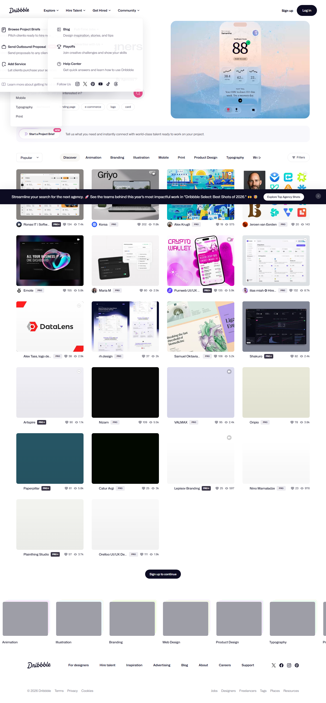

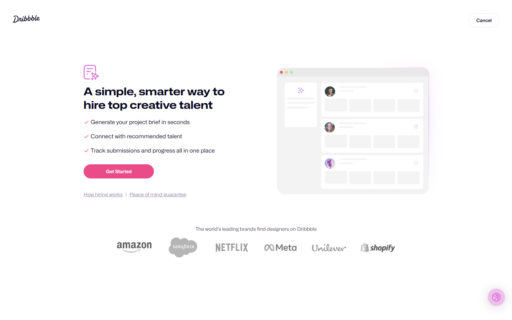


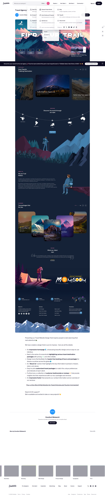

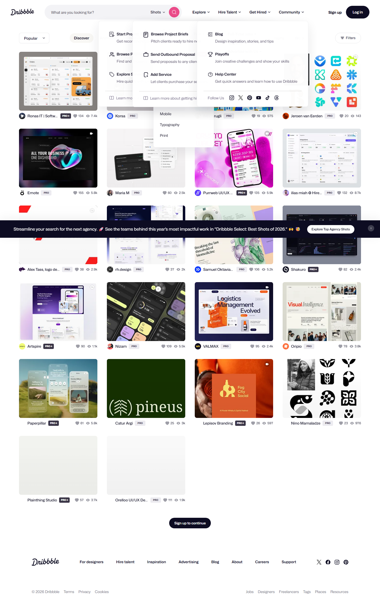

### Section Clips (screens/sections/)

*Clipped individual sections and components*

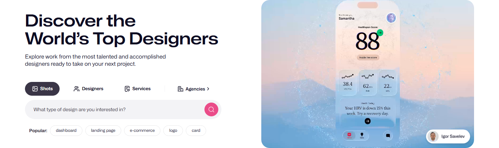

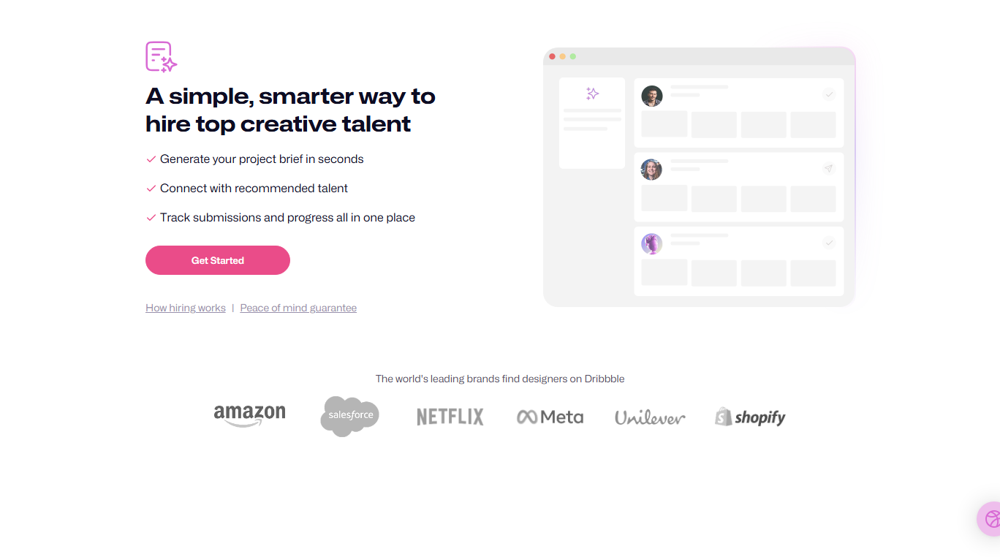

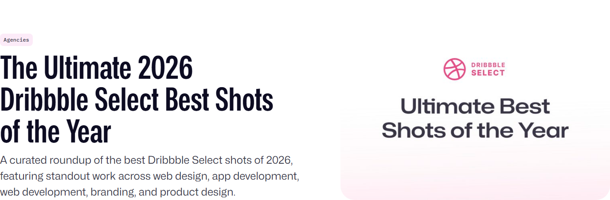

### Interaction States (screens/states/)

*Hover, focus, and active state captures*


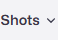


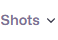


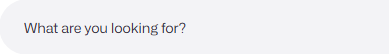

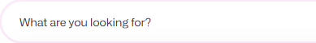


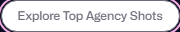


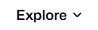


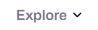

### Screenshot Index (screens/INDEX.md)

# Screenshot Index

## Scroll Journey

> Shows the cinematic state at each point of the page

| Scroll | Y Position | File |
|--------|-----------|------|
| 0% | 0px | `screens/scroll/scroll-000.png` |
| 17% | 1010px | `screens/scroll/scroll-017.png` |
| 33% | 1961px | `screens/scroll/scroll-033.png` |
| 50% | 2971px | `screens/scroll/scroll-050.png` |
| 67% | 3981px | `screens/scroll/scroll-067.png` |
| 83% | 4932px | `screens/scroll/scroll-083.png` |
| 100% | 5942px | `screens/scroll/scroll-100.png` |

## Pages

| Page | URL | File |
|------|-----|------|
| Travel Agency Website Design To Ignite The Wanderlust 🌎✈ by Excellent Webworld on Dribbble | `https://dribbble.com/shots/21290124-Travel-Agency-Website-Design-To-Ignite-The-Wanderlust` | `screens/pages/shots-21290124-Travel-Agency-Website-Design-To-Ignite-The-Wa.png` |
| Dribbble - Discover the World’s Top Designers & Creative Professionals | `https://dribbble.com/resources/agencies/ultimate-dribbble-select-best-shots` | `screens/pages/resources-agencies-ultimate-dribbble-select-best-shots.png` |
| Hire Top Creative Talent with a Project Brief | Dribbble | `https://dribbble.com/instantmatch` | `screens/pages/instantmatch.png` |
| Dribbble - Discover the World’s Top Designers & Creative Professionals | `https://dribbble.com/` | `screens/pages/home.png` |
| Dribbble - Discover the World’s Top Designers & Creative Professionals | `https://dribbble.com/shots/popular` | `screens/pages/shots-popular.png` |

## Sections

| Page | Section | File |
|------|---------|------|
| resources-agencies-ultimate-dribbble-select-best-shots | #1 (section) | `screens/sections/resources-agencies-ultimate-dribbble-select-best-shots-section-1.png` |
| instantmatch | #1 (main > div) | `screens/sections/instantmatch-section-1.png` |
| home | #1 ([class*="hero"]) | `screens/sections/home-section-1.png` |

## Homepage Screenshots (screenshots/)


