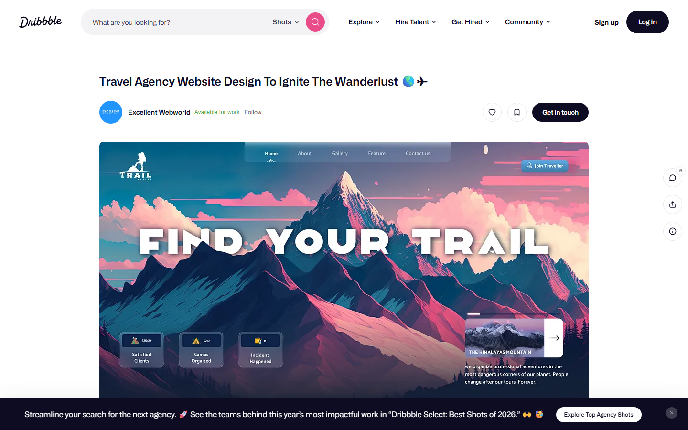
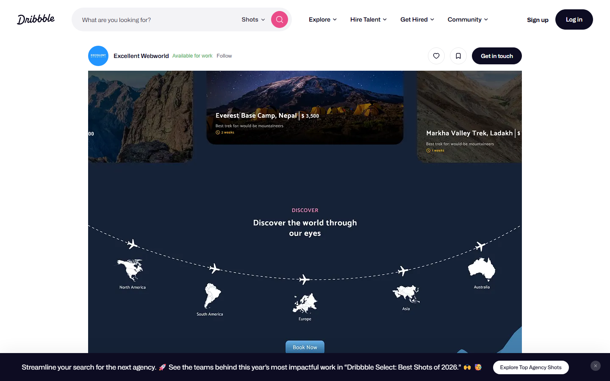
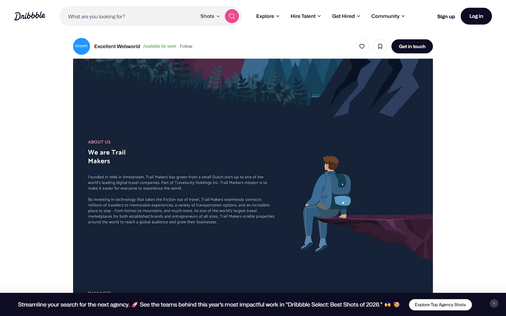
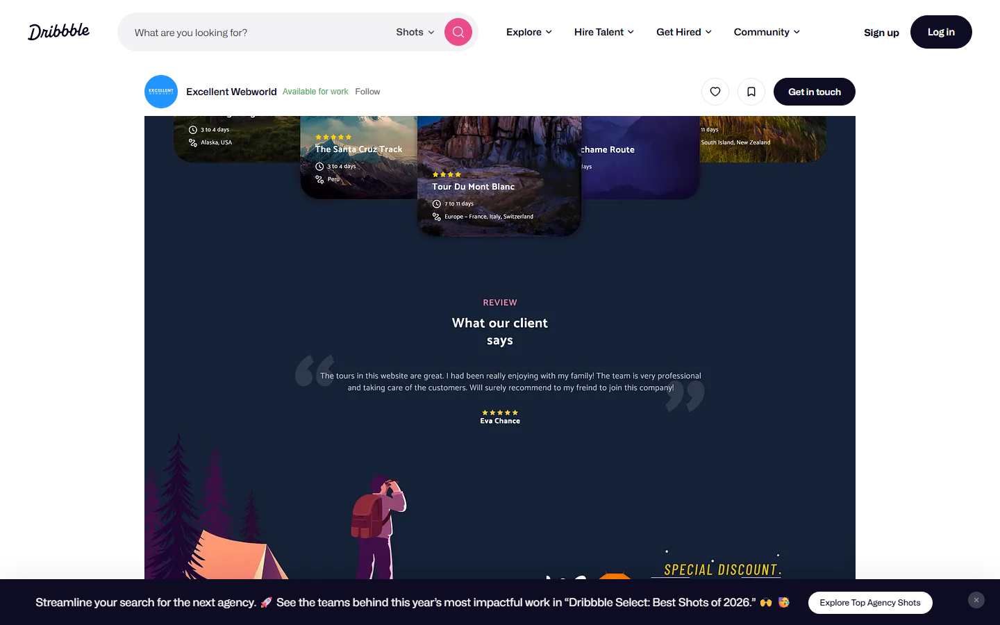
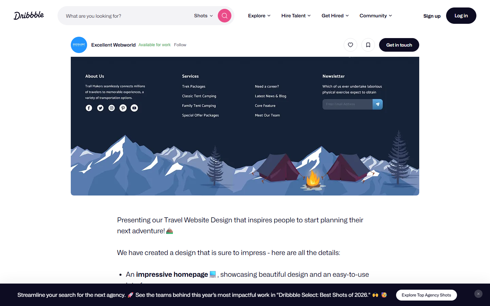
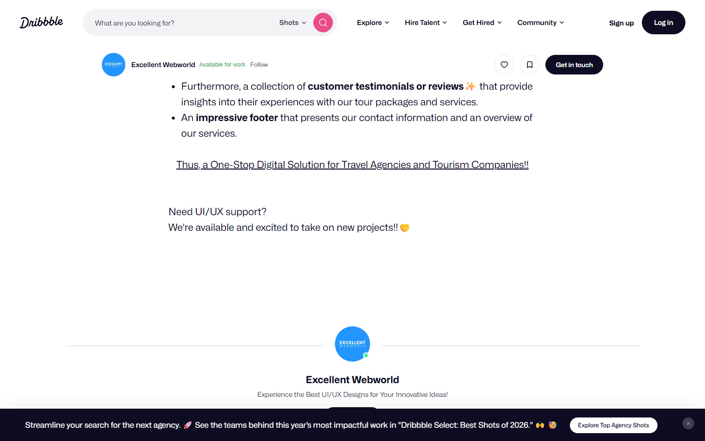
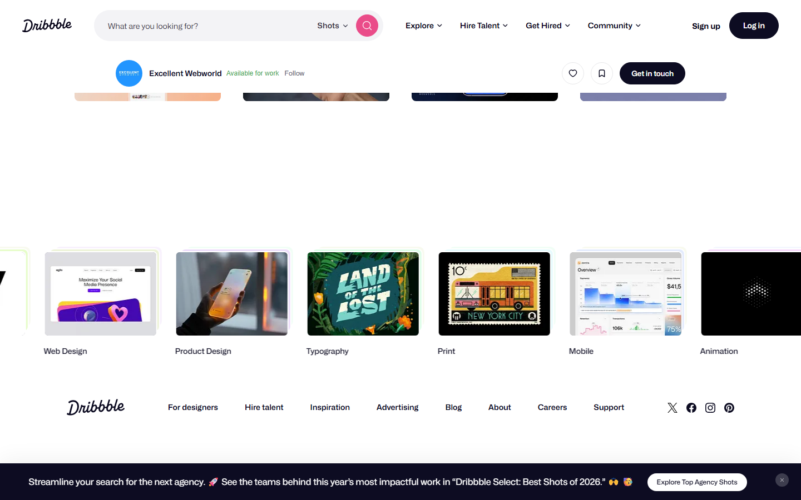

# Animation Reference

> Cinematic motion design extracted from live DOM. Follow these specs exactly to recreate the experience.

## Motion Technology Stack

| Library | Type | Notes |
|---------|------|-------|
| **Web Animations API (1 active)** | animation |  |

## Scroll Journey

The page is **6,842px** tall. Each frame below shows what the user sees at that scroll depth.

> **Use these screenshots to understand WHAT animates, WHEN it animates, and HOW it moves.**

### 0% — Top / Hero
Scroll position: 0px



### 17% — Opening Section
Scroll position: 1,010px



### 33% — First Feature Section
Scroll position: 1,961px



### 50% — Mid-Page
Scroll position: 2,971px



### 67% — Lower Content
Scroll position: 3,981px



### 83% — Near Footer
Scroll position: 4,932px



### 100% — Bottom / Footer
Scroll position: 5,942px



## Scroll Animation Patterns

| Pattern | Library | Element Count | Duration | Delay | Easing |
|---------|---------|---------------|----------|-------|--------|
| parallax / sticky scroll | CSS | 10 | — | — | — |

### CSS Implementation

## CSS Keyframes (2 extracted)

### `@keyframes skeleton-translate-d82d0ff5`

Duration: `2s` · Easing: `ease` · Delay: `0s` · Iteration: `infinite` · Fill: `none`

Used by: `.skeleton-template.animate-translate[data-v-d82d0ff5]::after`

```css
@keyframes skeleton-translate-d82d0ff5 {
  100% {
    transform: translate(100%);
  }
}
```

> Transform/motion animation

### `@keyframes skeleton-translate-24eaf5a2`

Duration: `2s` · Easing: `ease` · Delay: `0s` · Iteration: `infinite` · Fill: `none`

Used by: `.skeleton-template.animate-translate[data-v-24eaf5a2]::after`

```css
@keyframes skeleton-translate-24eaf5a2 {
  100% {
    transform: translate(100%);
  }
}
```

> Transform/motion animation

## Motion Tokens (CSS Variables)

### Other Tokens

```css
--sl-transition-fast: .15s;
--sl-transition-slow: .5s;
--sl-transition-x-slow: 1s;
--sl-transition-medium: .25s;
--sl-transition-x-fast: 50ms;
```

## Global Transition Declarations

These `transition` values were extracted from CSS rules across the site:

```css
transition: width 300ms ease-out, opacity 150ms ease-in 150ms;
transition: 0.2s;
transition: transform 0.2s;
transition: background 0.2s, border-color 0.2s;
transition: height 0.2s linear;
transition: width 0.3s linear;
transition: background-color 0.218s, border-color 0.218s;
transition: background-color 0.218s;
transition: opacity 0.5s cubic-bezier(0.22, 1, 0.36, 1);
transition: 0.3s ease-in-out;
transition: opacity 0.2s;
transition: 0.3s cubic-bezier(0.075, 0.82, 0.165, 1);
```

## How to Recreate This Motion Design

### Step 1 — Install Dependencies

```bash
```

### Step 2 — Scroll-Reveal Pattern

Elements that animate into view follow this pattern:

```css
/* Initial hidden state */
.reveal {
  opacity: 0;
  transform: translateY(40px);
  transition: opacity 300ms cubic-bezier(0.4, 0, 0.2, 1),
              transform 300ms cubic-bezier(0.4, 0, 0.2, 1);
}
.reveal.visible {
  opacity: 1;
  transform: translateY(0);
}
```

### Step 3 — Key Motion Principles

- **Duration scale:** `300ms` · `150ms` · `0.2s` — use these values, never invent new durations
- **Always add** `@media (prefers-reduced-motion: reduce) { * { animation-duration: 0.01ms !important; transition-duration: 0.01ms !important; } }`

### Step 4 — Scroll Journey Reference

Match what happens at each scroll position:

- **0%** (`0px`) → `screens/scroll/scroll-000.png`
- **17%** (`1010px`) → `screens/scroll/scroll-017.png`
- **33%** (`1961px`) → `screens/scroll/scroll-033.png`
- **50%** (`2971px`) → `screens/scroll/scroll-050.png`
- **67%** (`3981px`) → `screens/scroll/scroll-067.png`
- **83%** (`4932px`) → `screens/scroll/scroll-083.png`
- **100%** (`5942px`) → `screens/scroll/scroll-100.png`

