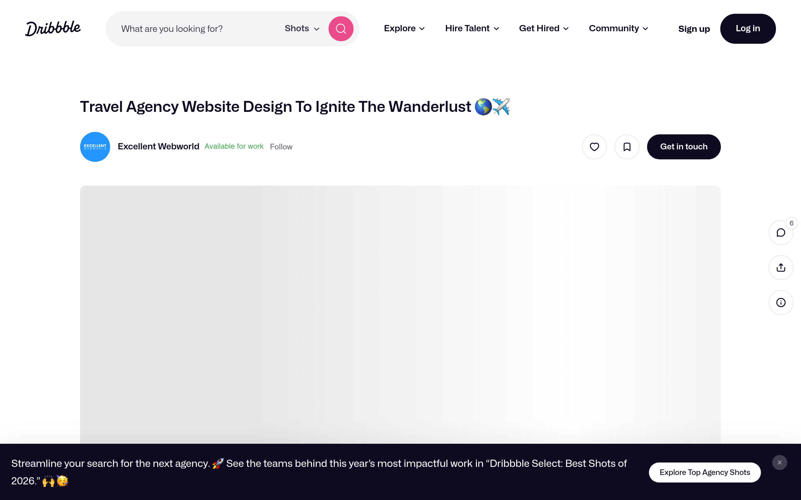

# wanderlust-travel DESIGN.md

> Auto-generated design system — reverse-engineered via static analysis by skillui.
> Frameworks: None detected
> Colors: 20 · Fonts: 3 · Components: 0
> Icon library: not detected · State: not detected
> Primary theme: dark · Dark mode toggle: no · Motion: none

## Visual Reference

**Match this design exactly** — study colors, fonts, spacing, and component shapes before writing any UI code.



---

## 1. Visual Theme & Atmosphere

This is a **dark-themed** interface with a neutral tone. Depth is expressed through layered shadows and subtle surface color variation. Typography pairs **Arial** for display/headings with **Mona Sans** for body text, creating clear visual hierarchy through type contrast. Spacing follows a **4px base grid** (compact density), with scale: 4, 6, 8, 10, 12, 14, 16, 18px.

---

## 2. Color Palette & Roles

| Token | Hex | Role | Use |
|---|---|---|---|
| background | `#0d0c22` | background | Page background, darkest surface |
| surface | `#060318` | surface | Card and panel backgrounds |
| text-primary | `#ffffff` | text-primary | Headings and body text |
| text-muted | `#6e6d7a` | text-muted | Captions, placeholders, secondary info |
| border | `#524b63` | border | Dividers, card borders, outlines |
| danger | `#ea4c89` | danger | Error states, destructive actions |
| info | `#3e34d3` | info | Informational highlights |
| unknown | `#b8509a` | unknown | Palette color |
| unknown | `#655c7a` | unknown | Palette color |
| unknown | `#000000` | unknown | Palette color |
| unknown | `#dbdbde` | unknown | Palette color |
| unknown | `#9e9ea7` | unknown | Palette color |
| unknown | `#3a3546` | unknown | Palette color |
| unknown | `#7b7194` | unknown | Palette color |
| unknown | `#e7e7e9` | unknown | Palette color |
| unknown | `#262627` | unknown | Palette color |
| unknown | `#9890ac` | unknown | Palette color |
| unknown | `#807ea3` | unknown | Palette color |
| unknown | `#d86ad4` | unknown | Palette color |
| unknown | `#f3f3f4` | unknown | Palette color |


---

## 3. Typography Rules

**Font Stack:**
- **Mona Sans** — Heading 1, Heading 2, Heading 3
- **Arial** — Body, Caption
- **IBM Plex Mono** — Code

**Font Sources:**

```css
@font-face {
  font-family: "Mona Sans";
  src: url("fonts/MonaSans-SemiBold.ttf") format("truetype");
  font-weight: 600;
}
@font-face {
  font-family: "Mona Sans";
  src: url("fonts/MonaSans-Bold.ttf") format("truetype");
  font-weight: 700;
}
@font-face {
  font-family: "Mona Sans";
  src: url("fonts/MonaSans-Regular.ttf") format("truetype");
  font-weight: 400;
}
@font-face {
  font-family: "IBM Plex Mono";
  src: url("fonts/IBMPlexMono-SemiBold.ttf") format("truetype");
  font-weight: 600;
}
@font-face {
  font-family: "IBM Plex Mono";
  src: url("fonts/IBMPlexMono-Bold.ttf") format("truetype");
  font-weight: 700;
}
@font-face {
  font-family: "IBM Plex Mono";
  src: url("fonts/IBMPlexMono-Regular.ttf") format("truetype");
  font-weight: 400;
}
```

| Role | Font | Size | Weight |
|---|---|---|---|
| Heading 1 | Mona Sans | 48px / 3rem | 700 |
| Heading 2 | Mona Sans | 32px / 2rem | 600 |
| Heading 3 | Mona Sans | 24px / 1.5rem | 600 |
| Body | Arial | 16px / 1rem | 400 |
| Caption | Arial | 12px / 0.75rem | 400 |
| Code | IBM Plex Mono | 14px | 400 |

**Typographic Rules:**
- Limit to 3 font families max per screen
- Use **Mona Sans** for body/UI text, **Arial** for display/headings
- Maintain consistent hierarchy: no more than 3-4 font sizes per screen
- Headings use bold (600-700), body uses regular (400)
- Line height: 1.5 for body text, 1.2 for headings
- Use color and opacity for secondary hierarchy, not additional font sizes


---

## 4. Component Stylings

No components detected. Scan `src/components/` or `components/` to populate this section.

---

## 5. Layout Principles

- **Base spacing unit:** 4px
- **Spacing scale:** 4, 6, 8, 10, 12, 14, 16, 18, 20, 24, 28, 30
- **Border radius:** 6px, 8px, 10px, 12px, 12px 12px 0px 0px, 16px, 20px, 24px, 32px, 70px, 70px 0px 0px 70px

**Spacing as Meaning:**
| Spacing | Use |
|---|---|
| 4-8px | Tight: related items within a group |
| 12-16px | Medium: between groups |
| 24-32px | Wide: between sections |
| 48px+ | Vast: major section breaks |


---

## 6. Depth & Elevation

### Raised — cards, buttons, interactive elements

- `rgba(0, 0, 0, 0.03) 0px 2px 6px 0px`

### Floating — dropdowns, popovers, modals

- `rgba(0, 0, 0, 0.1) 0px 0px 10px 0px`
- `rgba(0, 0, 0, 0.5) 0px 0px 10px 0px`

### Overlay — full-screen overlays, top-level dialogs

- `rgba(27, 32, 50, 0.1) 0px 15px 50px 0px`
- `rgba(0, 0, 0, 0.06) 0px -6px 40px 0px`
- `rgba(0, 0, 0, 0.06) 0px 1px 6px 0px, rgba(0, 0, 0, 0.16) 0px 2px 32px 0px`


---

## 8. Do's and Don'ts

### Do's

- Use `#0d0c22` as the primary page background
- Pair **Mona Sans** (body) with **Arial** (display) — these are the only allowed fonts
- Follow the **4px** spacing grid for all margins, padding, and gaps
- Use the defined shadow tokens for elevation — see Section 6
- Use border-radius from the scale: 6px, 8px, 10px, 12px, 12px 12px 0px 0px

### Don'ts

- Don't introduce colors outside this palette — extend the design tokens first
- Don't introduce additional font families beyond Mona Sans and Arial and IBM Plex Mono
- Don't use arbitrary spacing values — stick to multiples of 4px
- Don't create custom box-shadow values outside the system tokens
- Don't use gradients — the design uses solid colors only
- Don't use arbitrary border-radius values — pick from the defined scale
- Don't use backdrop-blur or blur effects

### Anti-Patterns (detected from codebase)

- No gradient backgrounds
- No blur or backdrop-blur effects
- No zebra striping on tables/lists


---

## 9. Responsive Behavior

No breakpoints detected. Consider adding responsive breakpoints to the design system.

---

## 10. Agent Prompt Guide

Use these as starting points when building new UI:

### Build a Card

```
Background: #060318
Border: 1px solid #524b63
Radius: 16px
Padding: 16px
Font: Mona Sans
Use shadow tokens from Section 6.
```

### Build a Button

```
Primary: bg var(--accent), text white
Ghost: bg transparent, border #524b63
Padding: 8px 16px
Radius: 16px
Hover: opacity 0.9 or lighter shade
Focus: ring with var(--accent)
```

### Build a Page Layout

```
Background: #0d0c22
Max-width: 1280px, centered
Grid: 4px base
Responsive: mobile-first, breakpoints from Section 9
```

### Build a Stats Card

```
Surface: #060318
Label: #6e6d7a (muted, 12px, uppercase)
Value: #ffffff (primary, 24-32px, bold)
Status: use success/warning/danger from Section 2
```

### Build a Form

```
Input bg: #0d0c22
Input border: 1px solid #524b63
Focus: border-color var(--accent)
Label: #6e6d7a 12px
Spacing: 16px between fields
Radius: 16px
```

### General Component

```
1. Read DESIGN.md Sections 2-6 for tokens
2. Colors: only from palette
3. Font: Mona Sans, type scale from Section 3
4. Spacing: 4px grid
5. Components: match patterns from Section 4
6. Elevation: shadow tokens
```
